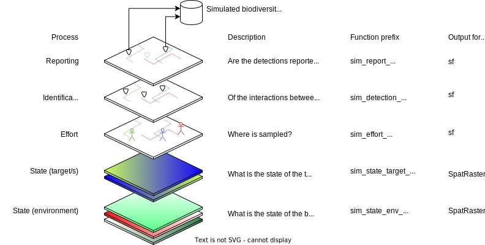

---
output:
  rmarkdown::github_document:
    html_preview: no
---

```{r setup, include=FALSE,echo=F}
knitr::opts_chunk$set(echo = TRUE)
library(STRIDER)
library(terra)
library(sf)
```

_Edit `README.Rmd` not `README.md`_

# STRIDER (STate, effoRt, Identification/DEtection, Reporting)

## Overview

STRIDER is an R package for simulating virtual species and the subsequent sampling and reporting. It's primary use is for simulating citizen science data to validate method development. The simulation is split into 4 processes:

 * State: what is the true state of the simulated reality?
     * Environment (e.g abiotic and biotic)
     * Target (e.g. species) what may be dependant on the environment
 * Effort: how is sampling effort allocated? (where/what/when are they sampling? who is doing the sampling?)
 * Identification/Detection: what happens when the sampler meets the species (is the species detected? is the species correctly identified?)
 * Reporting: how is the interaction reported? (is the species recorded? Are absences recorded? At what spatial resolution is it reported at?)
 

 
## Installation

Install from GitHub

```
remotes::install_github("BiologicalRecordsCentre/STRIDER")
```
 
## Requirements

`terra`, `sf`

## How to use the R package

For each of the 5 processes, there are choices of functions to use depending on your needs. For each process, there is the most basic version for demonstration purposes.

The functions all follow this basic schema whereby all the objects from the previous stage, along with the `background` object, are combined into a single `simulation_object`. This object is then used as an argument in the subsequent functions, whether or not they are actually used in the calculations within the function.

The `simulation_object` includes the following components:

- `@background`: Background extent and resolution of the simulated reality
- `@state_env`: Simulated state of the environment
- `@state_target`: Simulated state of the target (as a continuous probability)
- `@state_target_realised`: Simulated state of the target (as a realised absolute/binary value)
- `@effort`: Simulated sampling effort
- `@detect`: Simulated detection information
- `@report`: Simulated reporting information

You can access and manipulate the `simulation_object` at each step to generate the outputs of the corresponding processes. The outputs at each step are `terra` SpatRasters or `sf` feature collections (POINT), as shown in the figure above. You can use custom R scripts to generate the outputs of any of the steps, ensuring flexibility and interoperability.

The functions used at each stage are as follows:

 * `sim_state_env_...(simulation_object, ...)`
 * `sim_state_target_...(simulation_object, ...)`
 * `sim_state_target_realise_...(simulation_object, ...)`
 * `sim_effort_...(simulation_object, ...)`
 * `sim_detect_...(simulation_object, ...)`
 * `sim_report_...(simulation_object, ....)`
 
You could use the `targets` R package to create reproducible workflows for simulating your data.

## Simulating state

The term "state" refers to the underlying true conditions of the environment and the target. 

Environmental State: This refers to the simulated state of the environment, which can include various abiotic and biotic factors, such as temperature, humidity, terrain features, vegetation, or any other relevant ecological parameters. Simulating the environmental state facilitates understanding of how different environmental conditions may influence the presence or behaviour of the target species.

Target State: This represents the simulated distribution of the target within the environment. The target is often influenced by the environmental state. In STRIDER the target is represented in two forms: a continuous variable representing a probability of occurrence (slot `@state_target`), and a realised absolute value (slot `@state_target_realised`) which could contain a binary (0 or 1) representing species occupancy or a positive integer representing abundance.

In current form STRIDER represents states as being grid-based and relies on a consistent grid resolution/extent across all state variables. States are represented as rasters (`SpatRaster`) with any resolution, extent or CRS (or no CRS). We simulate the state of the environment and target separately. The simulation object uses a SpatRaster in slot `@background`. The resolution, extent and CRS is inherited from the background when simulating states.

In future developments we will consider using point process models describe the target state with slot `@state_target` capturing the intensity surface and `@state_target_realised` capturing the realised points.

### Defining the background

The background is simply a SpatRaster from which the CRS/extent/resolution will be used for subsequent simulation steps. Here we create a background using a 30x30 matrix then create a simulation object from it.

```{r}
# Create the background
background <- terra::rast(matrix(0,30,30))

# Create the simulation object
sim_obj <- SimulationObject(background = background)
sim_obj
```

### Simulating the environmental state

Here we want to represent the state of the environment. Essentially we need to capture variables (real or abstract) which influence where the target might exist, and where the effort might be allocated. This might include:

 * Physical features like altitude or slope
 * Climatic variable such as rainfall or temperature
 * Effort-impacting variables such as human population, focal points (e.g. nature reserves) or access features (footpaths).

The output of this stage is a SpatRaster with layers for each environmental variable. There is currently no way to capture non-gridded spatial features such as lines or polygons but you could derive grid-based approximations of it. This works well for time invariant environmental variables. If you need time variant environmental variables then the best current implementation is to create a simulation object for each time step, sample from each time step, sample from each time step, then aggregate later.

All functions for simulating environmental state start with `sim_state_env_`

The minimal version of this function is `sim_state_env_uniform()` which produces a simulation object with a single layer which is uniform in value in space.

The BYOD (Bring Your Own Data) function is `sim_state_env_byod()` where you can provide a SpatRaster with custom environmental state that meets you needs.

### Simulating the target state

Here we define the state of the target or targets. We define two versions of this: a continuous variable representing a probability of occurrence (slot `@state_target`), and a realised absolute value (slot `@state_target_realised`) which could contain a binary (0 or 1) representing species occupancy or a positive integer representing abundance. Here's an example: 

```{r realisation_diagram, echo=F}
sim_obj <- sim_state_target_uniform(sim_obj)
sim_obj <- sim_state_target_realise_binomial(sim_obj)
par(mfrow=c(1,2))
plot(sim_obj@state_target,main = "@state_target")
plot(sim_obj@state_target_realised,main = "@state_target_realised")
par(mfrow=c(1,1))
```

Both of these representations of state are represented in the simulation object as SpatRaster with layers for each target. Again, if you want the target to change over time then create a list of rasters where each list item represents the target state at each time step, but this will need some wrangling.

All functions for simulating target state start with `sim_state_target_`

The minimal version of this function is `sim_state_target_uniform()` which produces a uniform abundance across space.

The BYOD function is `sim_state_target_byod()` mening you could also use other packages to generate a target state (eg.rangeshiftR, virtualspecies) then convert the output to a `SpatRaster`.
 
## Simulating effort

In the context of STRIDER, "effort" refers to the representation of sampling activities, encompassing the allocation and execution of various sampling procedures across a defined landscape or study area.

Several factors could potentially predict the allocation and execution of sampling efforts, including but not limited to:

 * Accessibility: Proximity to human infrastructure, trails, or road networks might influence where sampling efforts are concentrated.
 * Environmental conditions: Factors such as topography, habitat type, and climate could affect the selection of sampling sites.
 * Species-specific considerations: The presence of specific target species or their preferred habitats could influence where sampling efforts are directed.

Functionally, effort in STRIDER currently describes:

 * Who (or what) is did the sampling?
 * Where did the samplers visit to do sampling?
 * When did the sampling happen? (this is captured implicitly)
 
There are many ways to simulate effort from sampling points based on cell weights, to agent based models, to manually setting specific locations for sampling therefore STRIDER only facilitates representing effort as the realisation of sampling procedures. If you want to capture information about probabilities of locations being sampled then either have a non-slotted SpatRaster, or capture this information in the environmental state.

The slot for effort is `@effort` and contains a sf spatial data frame with the following columns:

 * `sampler` - who (or what)
 * `visit` - the identifier for each visit by a sampler
 * `unit` - the identifier for each sampling unit within a visit
 * `cell_id` - where
 * `geometry` - where
 
Here's a very basic example where we generate effort comprising of two samplers, each making one visit, and within each visit they use two sampling units (meaning they had two opportunities to observe each target present).
 
```{r sampling data}
# Simulate the sampling effort
sim_obj <- sim_effort_uniform(sim_obj, n_samplers=2, n_visits = 1, n_sample_units = 2)
sim_obj@effort
```
 
All functions for simulating effort start with `sim_effort_`
 
The minimal function for this process is `sim_effort_uniform()` in which effort is uniformly distributed across the landscape.

`sim_effort_weighted()` can be used to sample from the target state but weighted unequally across the environment (a weighting layer is provided as a SpatRaster)

`sim_effort_byod()` can be used to bring your own data and sample but using specified locations

## Simulating identification/detection

In STRIDER, "detection" refers to the process of whether the applied effort identifies and records the presence of a target within the specified visit. It describes the interaction between realised target state and effort, but may also be influenced by environmental state. Detection can be influenced by various factors such as the sampling methodology, the proficiency of the observer, the environmental conditions, and the characteristics of the target species.

Given detection, "identification" refers to the accurate recognition and categorization of a species during the data collection process. This step involves correctly identifying the observed organism to the appropriate taxonomic group or species. Samplers may not always identify a target correctly and these functions may take confusion matrices. 

The minimal function for this process is `sim_detect_equal()` in which all targets are detected at equal probability.

## Simulating the reporting

The reporting phase in STRIDER is designed to simulate various reporting scenarios, considering factors such as reporting probabilities, data resolution, and recording platforms, among others.

Data may not be reported exactly as the sampler experienced it, for example:

 * Aggregating the detections across multiple sampling units into the species observed across in one visit.
 * Aggregating to a coarser spatial resolution
 * Only interesting or novel species are reported (eg. as a result of life listing)

The minimal function for this process is `sim_report_equal()` in which all data is reported at equal probability.

## Full example

```{r example}
library(STRIDER)
library(terra)
library(sf)

# Create the background
background <- terra::rast(matrix(0,30,30))

# Create the simulation object
sim_obj <- SimulationObject(background = background)

# Simulate the environment state
sim_obj <- sim_state_env_gradient(sim_obj)

# Simulate the target state
sim_obj <- sim_state_target_uniform(sim_obj, value = 0.5)

#realise the state
sim_obj <- sim_state_target_realise_binomial(sim_obj)

# Simulate the sampling effort
sim_obj <- sim_effort_uniform(sim_obj, n_visits = 100, replace = FALSE)

# Simulate the detection
sim_obj <- sim_detect_equal(sim_obj, prob = 0.5)

# Simulate the reporting
sim_obj <- sim_report_equal(sim_obj, prob = 0.8, platform = "iRecord")

plot(sim_obj@state_target_realised) # State of the target
plot(sim_obj@effort$geometry, add = TRUE,pch=16) # Effort
plot(sim_obj@detect$geometry[sim_obj@detect$detected == FALSE], col = "red", pch = 4, add = TRUE) # Highlight the non-detections
plot(sim_obj@report$geometry[sim_obj@report$reported], col = "yellow", add = TRUE) # Highlight reported records as yellow

#add a legend
legend(1, 5, legend=c("Sampled", "Not detected","Reported"),
       col=c("black","red", "yellow"), pch=c(16,4,1), cex=0.8,bg='grey')
```
