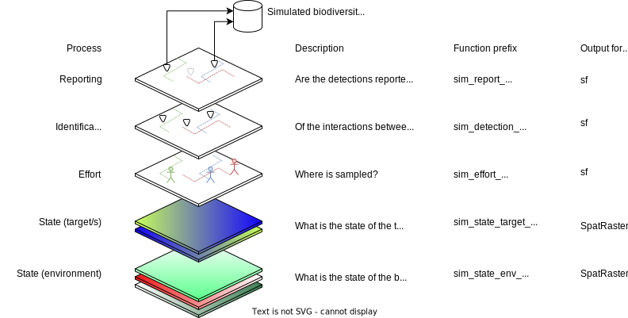
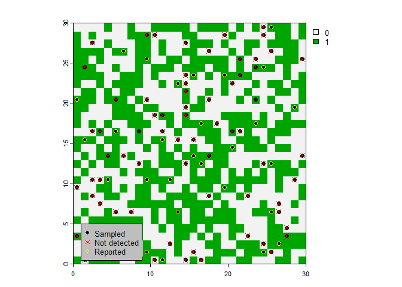

# STRIDER (STate, effoRt, Identification/DEtection, Reporting)

## Overview

STRIDER is an R package for simulating virtual species and the
subsequent sampling and reporting. It’s primary use is for simulating
citizen science data to validate method development. The simulation is
split into 4 processes:

- State: what is the true state of the simulated reality?
  - Environment (e.g abiotic and biotic)
  - Target (e.g. species) what may be dependant on the environment
- Effort: how is sampling effort allocated? (where/what/when are they
  sampling? who is doing the sampling?)
- Identification/Detection: what happens when the sampler meets the
  species (is the species detected? is the species correctly
  identified?)
- Reporting: how is the interaction reported? (is the species recorded?
  Are absences recorded? At what spatial resolution is it reported at?)



## Installation

Install from GitHub

    remotes::install_github("BiologicalRecordsCentre/STRIDER")

## Requirements

`terra`, `sf`

## How to use the R package

For each of the 5 processes there are choices of functions to use
depending on your need. For each the processes there is the most basic
version for demonstration purposes.

The functions all follow this basic schema whereby all the objects from
the previous stage are arguments in the subsequent functions, whether or
not they are actually used in the calculations within the function:

- `state_env    <- sim_state_env_______(background)`
- `state_target <- sim_state_target____(background, state_env, ...)`
- `effort       <- sim_effort__________(background, state_env, state_target, ...)`
- `detect       <- sim_detect__________(background, state_env, state_target, effort, ...)`
- `report       <- sim_detect__________(background, state_env, state_target, effort, detect, ...)`

There are no species STRIDER R objects, this is intentional as to allow
flexibility ad interoperability. The outputs at each step are `terra`
SpatRasters or `sf` feature collections (POINT) see figure above, so if
you can use custom R scripts to generate the outputs of any of the
steps.

You could use the `targets` R package to create reproducible workflows
for simulating your data.

## Simulating state

States are represented as rasters (`SpatRaster`) with any resolution,
extent or CRS (or no CRS). We simulate the state of the environment and
‘target’ separately. The state simulation functions take a raster which
is refereed to as the ‘background’, the resolution, extent and CRS is
inherited from this when simulating the state.

### Simulating the environmental state

Here we want to represent the state of the environment. Essentially we
need to capture variables (real or abstract) which influence where the
target might exist, and where the effort might be allocated. This might
include:

- Physical features like altitude or slope
- Climatic variable such as rainfall or temperature
- Effort-impacting variables such as human population, focal points
  (e.g. nature reserves) or access features (footpaths).

The output of this stage is a SpatRaster with layers for each
environmental variable. If you want the environmental variables to
change over time then create a list of rasters where each list item
represents the environmental state at each time step.

All functions for simulating environmental state start with
`sim_state_env_`

The minimal version of this function is `sim_state_env_uniform()` which
produces a raster with a single layer which is uniform in value in
space.

### Simulating the target state

Here we want to represent the target’s ‘intensity’ in space as a raster.
We can realise this as ‘abundance’. This might be dependant on the
simulated environmental state if that is relevant to your research
question.

The output of this stage is a SpatRaster with layers for each target. If
you want the target to change over time then create a list of rasters
where each list item represents the target state at each time step.

All functions for simulating target state start with `sim_state_target_`

The minimal version of this function is `sim_state_target_uniform()`
which produces a uniform abundance across space.

You could also use other packages to generate a target state
(eg.rangeshiftR, virtualspecies) then convert the output to a
`SpatRaster` in the same format as the STRIDER `sim_state_target_`
functions.

## Simulating effort

All functions for simulating effort start with `sim_effort_`

The minimal function for this process is `sim_effort_uniform()` in which
effort is uniformly distributed across the landscape.

`sim_effort_weighted()` can be used to sample from the target state but
weighted unequally across the environment (a weighting layer is provided
as a SpatRaster)

`sim_effort_points()` can be used to sample but using specified
locations (as provided as a simple features POINT collection)

`sim_effort_agent()` can be used to sample using an agent based approach
(not sure how this will be specified yet)

## Simulating identification/detection

The minimal function for this process is `sim_detect_equal()` in which
all targets are detected at equal probability.

## Simulating the reporting

The minimal function for this process is `sim_report_equal()` in which
all data is reported at equal probability.

## Demonstration of using simulated data to validate a model approach

Here we fit a very simple model using the simulated data

``` r
library(STRIDER)
library(terra)
```

    ## Warning: package 'terra' was built under R version 4.2.3

    ## terra 1.7.39

``` r
library(sf)
```

    ## Warning: package 'sf' was built under R version 4.2.3

    ## Linking to GEOS 3.9.3, GDAL 3.5.2, PROJ 8.2.1; sf_use_s2() is TRUE

``` r
background <- terra::rast(matrix(0,1000,600)) # create background
state_env <- sim_state_env_gradient(background) #environment
state_target <- sim_state_target_uniform(background,state_env,42) #target
effort <- sim_effort_uniform(background,state_env,state_target,n_visits=100,replace=F) #effort
detections <-sim_detect_equal(background,state_env,state_target,effort,prob=0.5) #detection
reports <- sim_report_equal(background,state_env,state_target,effort,detections,prob=0.8,platform="iRecord") #reports

plot(state_target) #state of target
plot(effort$geometry,add=T) #effort
plot(detections$geometry[detections$detected==F],col="red",pch=4,add=T) #highlight the non-detections
plot(reports$geometry[reports$reported],col="yellow",add=T) # highlight reported records as yellow
```

<!-- -->
